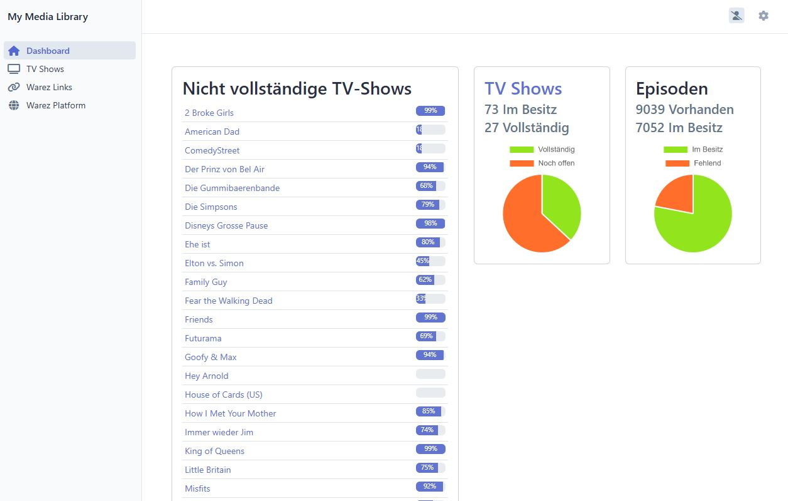

# my-media-library
## Idea
The idea behind the project is to examine your own TV shows for missing episodes and create an overview of which ones 
are still missing. After several years, I have downloaded many shows and in some cases have not been able to download 
all the episodes. In order not to lose the overview I compare the data with the api of thetvdb.com.



## Requirements
- docker-cli = 27.4.0

## Installation
1. create ``.env`` Files and fill in the necessary information
    ```bash
    cp .env.example .env
    cp ./symfony/.env.example ./symfony/.env
    ```

2. Fill in the necessary information in the ``symfony/.env`` Files
    ```bash
   # create a secret
    APP_SECRET=<SHA256-Hashed-secret>
   
   # create an account on https://thetvdb.com/ for api token/key/pin
    THETVDB_TOKEN=token
    THETVDB_APIKEY=key
    THETVDB_PIN=pin
    ```
 
3. Build the Docker Containers
    ```bash
    docker-compose build
    ```

4. Start the Docker Containers
    ```bash
    docker-compose up -d
    ```

5. Install the Composer Dependencies, Migrations & Assets
    ```bash
    docker exec -it my_media_library_php sh -c "sh start.sh"
    ```

## Connect with php container
```bash
docker exec -it my_media_library_php /bin/bash
```

# Demo Data
```bash
docker exec -it my_media_library_php sh -c "sf doctrine:fixtures:load --no-interaction"
```

## References
- [Docker](https://www.docker.com/)
- [Symfony](https://symfony.com/)
- [TheTVDB](https://thetvdb.com/)
- [TheTVDB Api](https://thetvdb.github.io/v4-api/)
- [TheTVDB Api - GitHub](https://github.com/thetvdb/v4-api)
